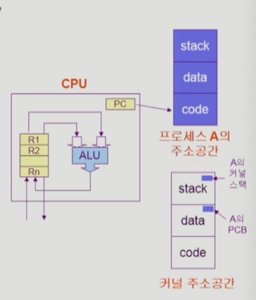
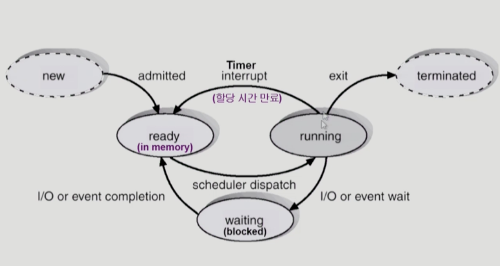
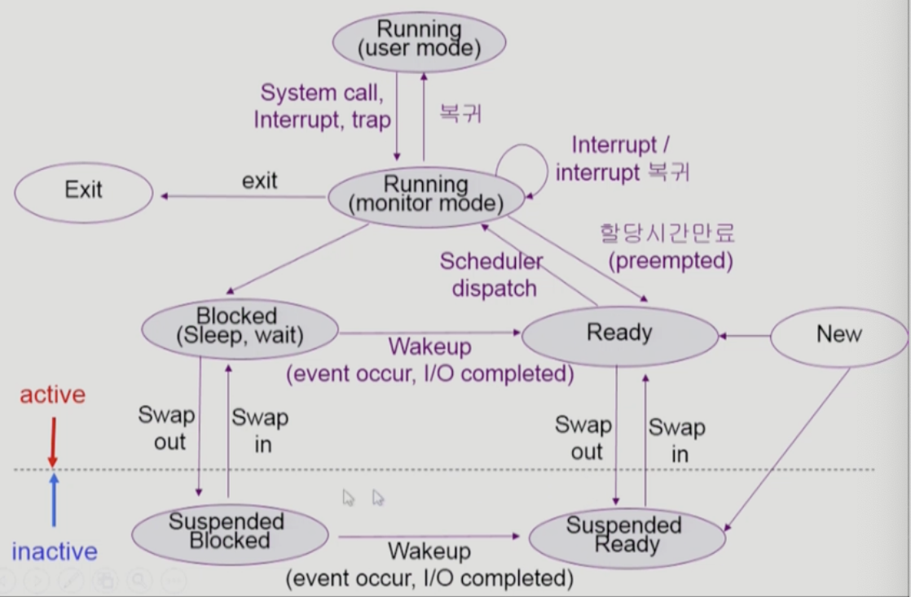
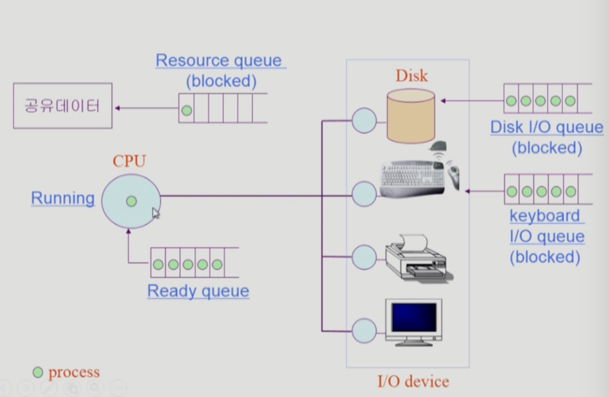
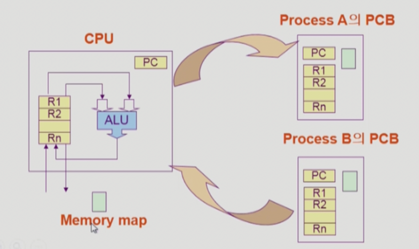
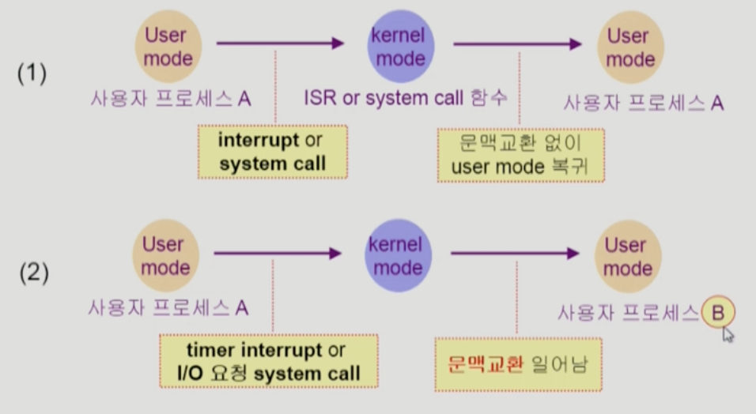
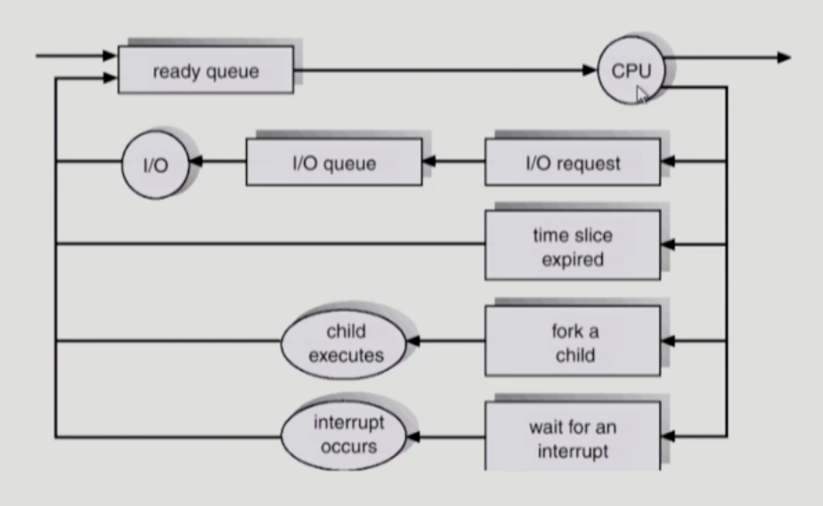

# Process 1

## 프로세스의 개념

- `Process is a program in excution`
- 프로세스의 문맥 `context` (현재 프로그램의 상태를 정확하게 파악하기 위한 정보들)
  - CPU 수행 상태를 나타내는 하드웨어 문맥
    - Program Counter
    - 각종 register(현재 실행값, 결과값을 담고 있는 고속의 저장장치)
  - 프로세스의 주소 공간(code, data, stack)
  - 프로세스 관련 커널 자료 구조
    - PCB(Process Control Block)
    - Kernel stack

프로세스란, 실행중인 프로그램을 의미한다.

하나의 프로세스만 실행되는게 아니라, 시분할 방식으로 짧은 기간안에 여러 프로세스가 실행된다. 그렇기 때문에 CPU 제어권을 다른 프로세스로 넘겼다가, 다시 받는 경우 해당 프로세스의 진행 상황을 알아야 이어서 진행할 수 있다. 그러한 프로세스의 현재 상태 및 진행 상황을 `컨텍스트` 라고 하는 것이다. 

컨텍스트란, 프로세스를 실행하기 위한 정보의 총체라고 할 수 있다. 그렇기 때문에 이를 실제로 실행하는 CPU가 메모리의 어느 영역을 가리키고 있는지를 알아야하고, 이전에 저장된 값들도 기록해야 한다. 이것이 PC, register이다.

또한 해당 프로세스 자체가 가지는 정보인 stack, dada, code 역시 프로세스 실행에 필수적인 부분이므로, 컨텍스트에 포함된다.

또한, 프로세스가 시스템 콜으로 운영체제에게 작업을 맡기는 경우, 해당 요청이나 필요한 데이터, 호출할 함수등에 대한 정보 역시 있어야 한다. 

 

## 프로세스의 상태 (Process state)

프로세스는 상태가 변경되며 수행된다.

- `Running` : cpu를 잡고 instruction을 수행중인 상태
- `Ready` : cpu를 기다리는 상태(메모리 등 다른 조건을 모두 만족하고)
- `Blocked`(wait, sleep)
  - CPU를 주어도 당장 instruction을 수행할 수 없는 상태
  - process 자신이 요청한 event가 즉시 만족되지 않아 이를 기다리는 상태
  - 예) 디스크에서 파일을 읽어와야하는 경우
- `Suspended`(stopped)
  - 외부적인 이유로 프로세스의 수행이 정지된 상태
  - 프로세스는 통째로 디스트에 swap out 된다
  - 예) 사용자가 프로그램을 일시정지 시킨 경우(break key), 시스템이 여러 이유로 프로세스를 잠시 중단 시킴(메모리에 너무 많은 프로세스가 올라와 있을 때)

- New : 프로세스가 생성중인 상태
- Terminated : 수행이 끝난 상태

`Blocked` 는 자신이 요청한 `event` 가 만족되면 `Ready` / `Suspended` 는 외부에서 `resume` 해 주어야 `Active`

## PCB

운영체제가 각 프로세스를 관리하기 위해 프로세스당 유지하는 정보로, 다음의 구성 요소를 가진다. PCB는 커널의 데이터 영역에 있다.

1. OS가 관리상 사용하는 정보
   - Process state, Process ID
   - Scheduling information, priority
2. CPU 수행관련 하드웨어 값
   - Program Counter, register
3. 메모리 관련
   - Code, data, stack의 위치
4. 파일 관련
   - Open file descriptors

## 문맥 교환 Context Switch

CPU를 한 프로세스에서 다른 프로세스로 넘겨주는 과정으로, CPU가 다른 프로세스로 넘어갈 떄 운영체제는 다음을 수행한다.

1. CPU를 내어주는 프로스세의 상태를 그 프로세스의 PCB에 저장
2. CPU를 새롭게 얻는 프로세스의 상태를 PCB에서 읽어옴

**시스템 콜이나 인터럽트 발생시 반드시 컨텍스트 스위치가 일어나는 것은 아님!** 컨텍스트 스위치는 실행할 프로세스를 변경할 때 발생하는 것. 따라서 **사용자 프로세스 -> 운영체제** 는 컨텍스트 스위치가 아니다.

(1)의 경우에도 CPU 수행 정보등 context 일부를 PCB에 저장해야 하지만, 문맥교환을 하는 (2) 의 경우 그 부담이 훨씬 큼. 문맥교환시 캐시 메모리를 다 비워야하기 때문. 이때 오버헤드가 많이 든다. 커널모드 <-> 사용자 모드 정도는 캐시메모리를 다 비울 필요는 없음

## 프로세스를 스케쥴링하기 위한 큐

- Job queue : 현재 시스템 내에 있는 모든 프로세스의 집합
- Ready queue : 현재 메모리 내에 있으면서 CPU 제어권을 받기 위해 기다리는 프로세스의 집합(ready 상태인 것)
- Device queue : IO 디바이스의 처리를 기다리는 프로세스 집합(blocked 상태인 것)

## 스케줄러 Scheduler

`Long-term scheduler (장기 스케줄러 or job scheduler)`

- 시작 프로세스 중 어떤 것들을 ready queue로 보낼지 결정
- 프로세스에 memory(및 각종 자원)을 주는 문제
- Degree of Multiprogramming을 제어
- Time sharing system에는 보통 장기 스케줄러가 없음(무조건 ready)

`Short-term scheduler (단기 스케줄러 or CPU scheduler)`

- 어떤 프로세스를 다음번에 running 시킬지 결정
- 프로세스에 CPU를 주는 문제
- 충분히 빨라야 함(millisecond 단위)

`Medium-term schduler(중기 스케줄러 or Swapper)`

- 여유 공간 마련을 위해 프로세스를 통째로 메모리에서 디스크로 쫓아냄
- 프로세스에게서 memory를 뺏는 문제
- Degree of Multiprogramming을 제어

____

**Reference**

- https://core.ewha.ac.kr/publicview/C0101020140318134023355997?vmode=f