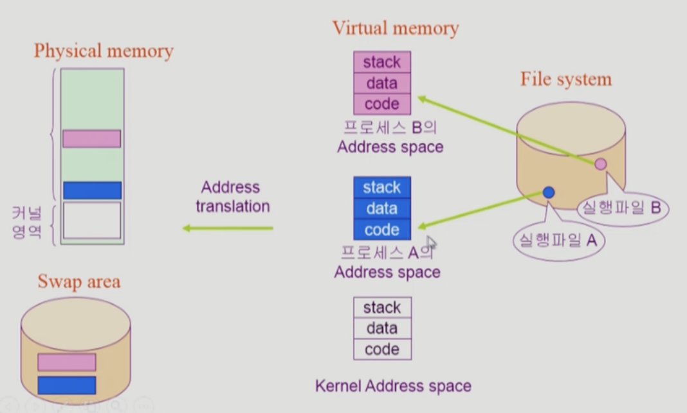

# System Structure & Program Execution2

## 동기식 입출력 비동기식 입출력

입출력 처리 방식은 크게 동기, 비동기로 나뉜다. 처리 방식은 다르지만, 둘다 작업 종료를 인터럽트를 발생시켜 알린다.

### 동기식(Synchronous) 입출력

- IO 요청 후 입출력 작업이 완료된 후에야 제어가 사용자 프로그램에 넘어감. 이전 작업의 결과를 기다리는 것
- 구현방법 1
  - IO가 끝날 때까지 CPU를 낭비시킴
  - 매시점 하나의 IO만 일어날 수 있음
- 구현방법2
  - IO가 완료될 때까지 해당 프로그램에게서 CPU를 빼앗음
  - IO 처리를 기다리는 줄에 그 프로그램을 줄 세움
  - 다른 프로그램에게 CPU를 줌
  - 비동기처럼 보이지만, 비동기는 현재 사용자 프로그램에 제어권을 넘기는 것이고 / 이 방법은 다른 프로세스에 제어권을 넘기는 것임

### 비동기식(Asynchronous) 입출력

- IO가 시작된 후 입출력 작업이 끝나기를 기다리지 않고 제어가 사용자 프로그램에 즉시 넘어감

## DMA(Direct Memory Access)

- 원래는 IO 장치에 접근 가능한 것은 CPU 뿐이지만, 다양한 입출력 장치로 인해 과도한 인터럽트 발생으로 오버헤드가 발생하는 것은 해결하기 위한 장치
- 빠른 입출력 장치(인터럽트가 빈번한)를 메모리에 가까운 속도로 처리하기 위해 사용
- CPU의 중재없이 device controller가 device의 buffer storage의 내용을 메모리에 block 단위로 직접 전송
- 바이트 단위가 아니라 block 단위로 인터럽트를 발생시킴(입출력 요청을 일정량 누적한 다음 일정 크기 이상일 때 한번 인터럽트 함)

## 서로 다른 입출력 명령어

- IO를 수행하는 special instruction에 의해
- Memory Mapped IO에 의해

좌 : 메모리 접근 인스트럭션 따로, 디바이스 접근 인스트럭션 따로

우 : 0~n 은 메모리 접근, n~2n은 디바이스 접근. 그냥 인덱스정도로만 구별한 것

## 저장장치 계층 구조

- 휘발성 / 비휘발성
- CPU에서 직접 접근 가능한 것(bite 단위로 작성된 것) / 그렇지 않은 것(sector 단위로 작성된 것)
- 처리 속도가 빠른 것 / 느린 것

## 프로그램 실행(메모리 load)

### 가상 메모리

프로세스(프로그램이 실행을 위해 메모리에 적재된 상태) 전체가 메모리에 올라가면, 메모리를 너무 많이 차지 하게 되고 현재 실행 부분이 아니어도 전체가 올라간다. 메모리 용량이 작아지고, 새로운 프로그램 실행에 있어 컨텍스트 스위칭이 빈번하여 오버헤드가 심한 문제 발생. 이러한 문제 해결을 위해 가상 메모리를 사용.

- 프로그램을 실행하기 위한 각 프로그램마다 0번 부터 시작하는 독자적인 주소공간
- 주소공간 = 코드, 데이터, 스택
  - 코드 : 기계어 집합
  - 데이터 : 전역, 지역 변수
  - 스택 : 코드에서 함수등을 사용할 때 돌아가기 위한 콜 스택

### 물리 메모리

실제 메모리 영역. 현재 실행하고자 하는 프로세스의 가상 메모리 중에서 지금 당장 필요한 부분만을 적재한다. 실행이 종료되거나 필요하지 않으면 아예 지워버리는 것이 아니라 `Swap area` 에 잠깐 내려 놓는다.

### 커널의 주소 공간

Program Control Block : 실행중인 각 프로그램의 제어 정보를 담은 데이터로, 실행프로그램 하나 당 PCB 하나가 생성된다.

### 사용자 프로그램이 사용하는 함수

프로그램은 유저 모드와 커널모드를 번갈아가면서 실행된다. 유저 모드에서 실행되다가, 커널 함수를 호출하면 시스템콜을 발생시켜 커널모드로 변경된다.

- 사용자 정의 함수
  - 자신의 프로그램에서 정의한 함수
  - 호출하면, 해당 프로세스의 코드영역에서 점프하여 실행 됨
- 라이브러리 함수
  - 자신의 프로그램에서 정의하지 않고 갖다 쓴 함수
  - 자신의 프로그램의 실행 파일에 포함되어 있다. 어쨋든 실행될 때 컴파일 되기 때문에 프로세스의 code에 들어감
  - 마찬가지로, 호출시 해당 프로세스 코드 영역에서 점프하여 실행됨
- 커널 함수
  - 운영체제 프로그램의 함수
  - 커널 함수의 호출  = 시스템 콜
  - 사용자 프로세스의 코드 스택에 있지 않음. 그래서 시스템콜을 호출하여 운영체제에게 실행을 맡겨야 함

____

**Reference**

- https://core.ewha.ac.kr/publicview/C0101020140314151238067290?vmode=f