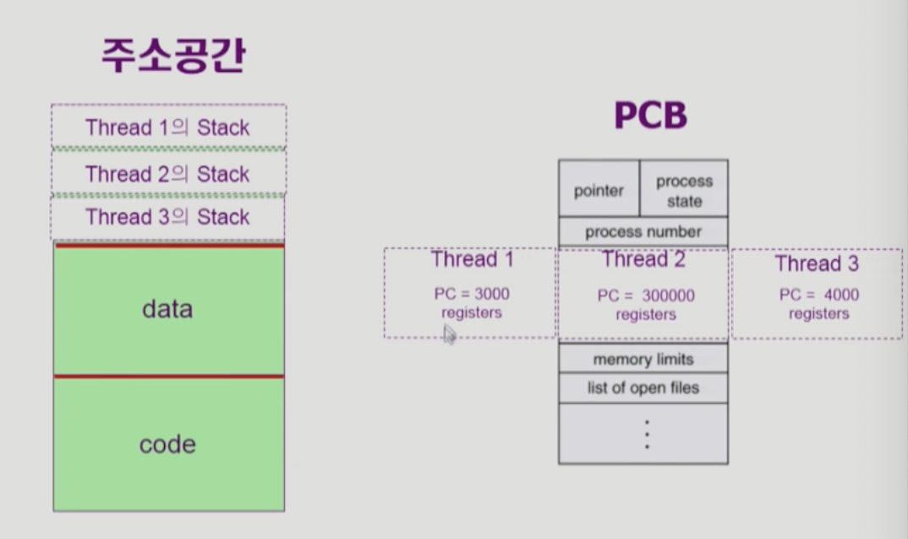
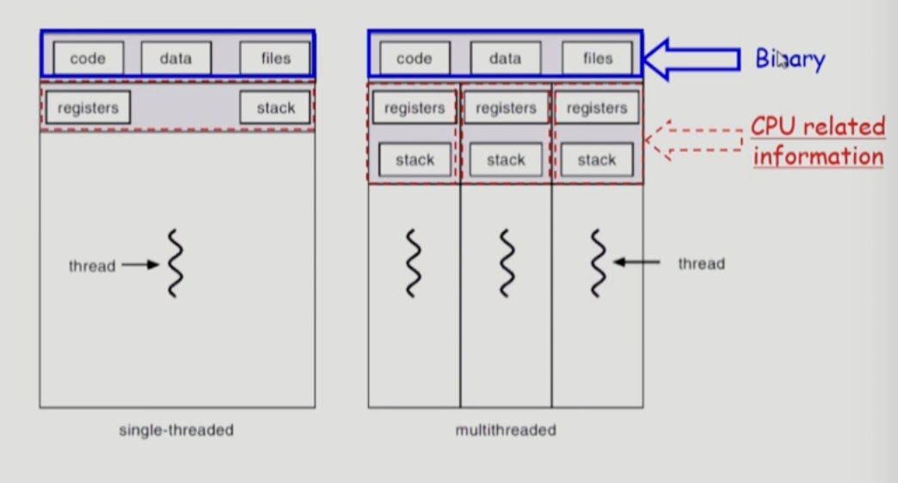

# Thread

Thread의 개념과 특징을 알아보자.

## Tread 란?

- A `Thread`(or `Lightweight precress` ) is a basic unit of CPU utilization
- Thread의 구성
  - Program counter
  - Register set
  - Stack space

- Thread가 동료 thread와 공유하는 부분(=task)
  - Code section
  - Data Section
  - OS resources
- 전통적인 개념의 heavyweight process는 하나의 thread를 가지고 있는 task로 볼 수 있다.

프로세스 내부의 CPU 수행 단위가 여러개 있는 경우, 그것은 스레드라고 부른다. 위 그림처럼 한 프로세의 스레드는 프로세스의 대부분의 정보를 공유한다. 스레드는 프로세스의 서로 다른 함수에 접근해야 하므로 각자의 함수콜스택이 필요하다. 그리고 같은 이유로 서로 실행하는 코드의 위치가 다르므로 PC도 달라야 할 것이며, 그 코드를 실행한 결과값을 저장할 register도 달라야 할 것이다. 따라서 Stack, PC, register는 프로세스와 공유하지 않고, 스레드 생성시 새로 생성되는 것이다. 쓰레드끼리 공유하는 부분은 태스크라고 하며, 쓰레드가 아무리 많아도 태스크는 하나다.

## Thread의 장점

- 다중 스레드로 구성된 태스크 구조에서는 하나의 서버 스레드가 blocked(waiting) 상태인 동안에도 동일한 태스크 내의 다른 스레드가 실행(running)되어 빠른 처리를 할 수 있다.
- 동일한 일을 수행하는 다중 스레드가 협력하여 높은 처리율(throughput)과 성능 향상을 얻을 수 있다.
  - 프로세스가 실행되려면 프로세스의 실행부분이 일단 메모리에 올라가야 한다. 같은 일을 하는 프로세스를 여러개 실행한다면 그만큼 메모리에 각각 올려야 된다. 그래서 메모리 낭비가 심해진다.
  - 하지면 스레드는 프로세스의 데이터나 코드부분을 공유하기 때문에, 새로운 스레드에 대해서는 PC,register, stack 정도의 공간만 만들어주면 된다. 훨씬 가볍고 효율적.
- 스레드를 사용하면 병렬성을 높일 수 있다.

**장점 요약**

1. `Responsiveness`
   - 예) 멀티스레드웹 : 하나의 스레드가 블락되어도 다른 스레드는 실행 한다.(이미지 get 요청이 아직 안불러와져도 text들 먼저 보여준다. 일종의 비동기식 입출력)

2. `Resource Sharing`
   - 여러개의 스레드는 프로세스의 코드, 데이터, 자원을 공유할 수 있다.
3. `Economy`
   - Creating & CPU switching thread(rater than a process)
   - Solaris의 경우 두가지의 오버헤드가 각각 30배, 5배
   - 프로세스의 컨텍스트 중에서는 스레드가 공유 가능한 부분이 많고, 프로세스 컨텍스트 스위칭 할때 캐시 메모리 비워야 하는데 스레드는 그렇지 않다.
4. `Utilization of MP Architectures`
   - 각 스레드는 서로 다른 CPU에서 병렬적으로 실행가능하다.

## Implementation of Threads

- Some are supported by `kernel` => `Kernel Thread`

  - 스레드가 여러개 있다는 것을 운영체제 커널이 알고 있어서, 스레드 스위칭을 운영체제가 프로세스 스위칭 하듯이 스케쥴링해줌

  - Ex

    - Windows 95/9b/NT

    - Solaris

    - Digital UNIX, Mach

- Other are supported by `library` => `User Thread`

  - 스레드가 여러개 있다는 것을 운영체제 커널이 모름. 그래서 그냥 프로세스 자체가 내부적으로 스레드로 돌아감(라이브러리 사용해서)
  - Ex
    - POSIX Pthread
    - Mach C-Thread
    - Solaris thread

- Some are real-time threads

____

**Reference**

- https://core.ewha.ac.kr/publicview/C0101020140321141759959993?vmode=f